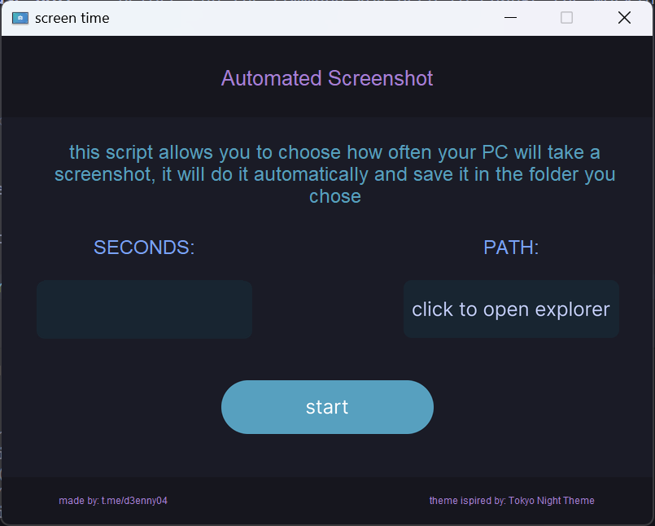

# Screenshot timer
### This script enable you to take a fullscreen screenshot as often as the user chooses

## INSTALLATION
---
- This project is made in Python🐍, so you need to install it before run this program.
    - If you use windows you can install it from the microsoft store.
    - After have installed it make sure you have the path of the python.exe in your enviroments variable.
- After that you need to satisfy the program's dependencies
    - to do this you need to have installed `pip` on your system and write the following command in you terminal
    - **Please note**: Before run the command you need to change the working directory in the root project directory

    ``` pip install -r dependency/requirements.txt```

## EXECUTE
---
- to execute this script open a terminal
    - go to the root project directory with `CD` command
    - execute this command:
    ```
    python main.py
    ```
- that's the output
    

- in seconds text area you need to write the amount of time (in seconds) between avery screenshot
- in path you need to specify which is the path where the script save the scription

## CONTACT
---
<center>
  <table border=0>
    <tr>
      <td>
        <a href="https://github.com/D3ENNY">
          
        </a>
      </td>
      <td>
        <a href="mailto:denysraimondi06@gmail.com">
          
        </a>
      </td>
        <td>
          <a href="https://t.me/D3ENNY04">
            
          </a>
      </td>
    </tr>
    <tr>
      <td>github</td>
      <td>email</td>
      <td>telegram</td>
    </tr>
  </table>
</center>

## SUPPORT ME
---
If you want support me and my project you can give me a little donation at:
<center>
  <table border=0>
    <tr>
      <td>
        <a href="https://paypal.me/denysraimondi">
          
        </a>
      </td>
      <td>
        <a href="https://www.buymeacoffee.com/D3ENNY">
          
        </a>
      </td>
    </tr>
    <tr>
      <td>paypal</td>
      <td>Buy Me A Coffee</td>
    </tr>
  </table>
</center>
